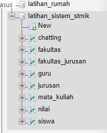

## stmik open source website
sistem ini menggunakan html, css, php dan javascript

## preview

## Database
Lakukan Import database ke dalam mySql dengan menggunakan file latihan_sistem_stmik.sql
otomatis akan tercipta 8 table berikut datanya

## contact
intrested untuk menggembangkan hal serupa? Contact Me
Shafira Andrea : firaandreaa06@gmail.com, Student of : Stmik Mardira Indonesia University
 